# Rotary Moulder Workbench — User Guide

## Contents

1. [Concepts](#1-concepts)
2. [Tutorial: build a complete mould](#2-tutorial-build-a-complete-mould)
3. [Command reference](#3-command-reference)
4. [Object reference](#4-object-reference)
5. [Patterns](#5-patterns)
6. [Docker pins](#6-docker-pins)
7. [Debug mode](#7-debug-mode)
8. [Troubleshooting](#8-troubleshooting)

---

## 1. Concepts

### The mould drum

A rotary moulder drum is a cylinder with cookie-shaped cavities cut
into its outer surface. Dough is pressed against the drum, fills the
cavities, then the formed cookies are released onto a conveyor belt.

For cookies to release properly, every cavity wall needs **draft** —
the floor of the cavity is narrower than the rim. This workbench
handles the draft automatically.

### Flat sketches → curved geometry via Sketch_On_Surface

You design the cookie outline as a flat (2D) sketch on the **XY
plane**. Before passing it to this workbench, you project the sketch
onto the drum's cylindrical face using the **Curves Workbench's
`Sketch_On_Surface`** feature. The resulting Sketch_On_Surface object
is what you select as the "cookie outline" for the cavity.

The mapping convention used by Sketch_On_Surface (and therefore by
this workbench):

- A sketch's **X** coordinate maps to angular position around the drum
- A sketch's **Y** coordinate maps to axial position along the drum
- The full sketch width represents one full wrap (2π radians) around
  the drum, so a sketch X range of `0..π × diameter` corresponds to a
  full circumference

Detail and docker outlines, by contrast, use **flat sketches directly**
(no Sketch_On_Surface needed) — they are projected internally using
the parent cavity's SoS mapping so they land at the correct angular
position. Use familiar Sketcher tools (rectangles, splines, ShapeString
text, points, etc.) for these.

### Object hierarchy

A typical project tree looks like:

```
Drum
└─ Cavity (or CavityPattern)
   ├─ Outline (a Sketch_On_Surface, projecting a flat sketch)
   │  └─ (the source flat sketch on XY plane)
   ├─ CavityDetail        (letters/shapes inside the cavity)
   │  └─ Outline (flat sketch on XY plane)
   └─ CavityDockers       (perforation pins)
      └─ Outline (flat sketch on XY plane with points)
```

Each cavity can have multiple detail and docker children. The cavity
**outline** is an SoS object; detail and docker outlines are flat
sketches.

### Draft direction

All cavities use **floor_narrower** draft — the cavity opens wider at
the drum surface than at the floor, so dough pulls out cleanly.

For details (letters/shapes), the same logic applies:

- **Engrave** mode (text recessed into floor): a small drafted pocket
  inside the cavity, narrower at the bottom of the engraving.
- **Emboss** mode (text raised above floor): a small drafted bump,
  narrower at the top of the bump.

In both modes the wider side is whichever is "outside" the cookie, so
the dough releases.

---

## 2. Tutorial: build a complete mould

This walkthrough builds a 6 × 3 pattern of rectangular cookies with
the letters "MSC" embossed and a few docker pins per cookie.

### Step 1 — Create the drum

1. Switch to the **Rotary Moulder** workbench
2. Click the **Create Drum** button
3. Accept defaults (D = 100 mm, L = 200 mm) — or set your own
4. A `Drum` object appears in the tree

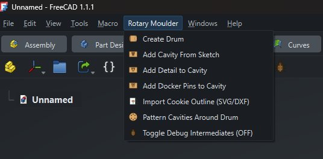

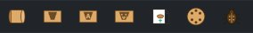

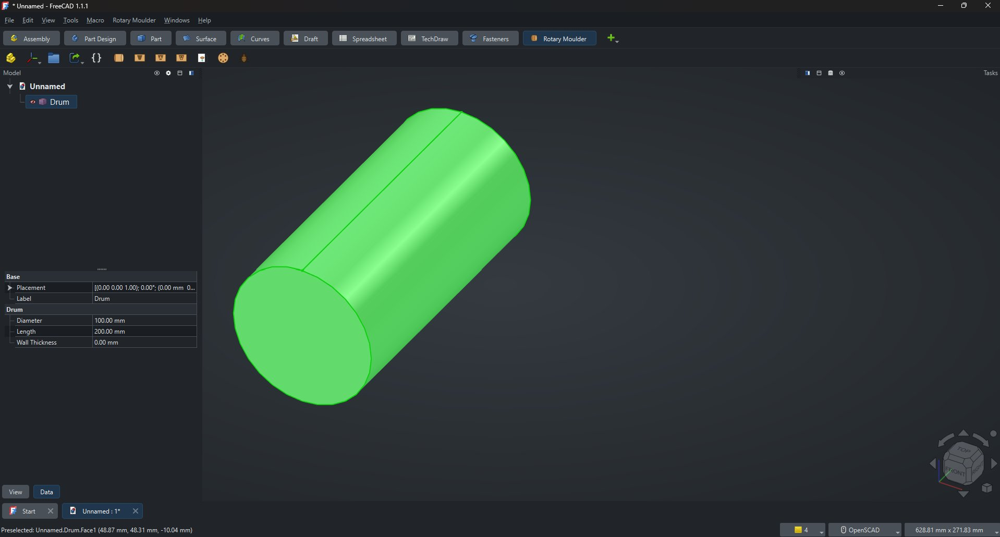

You can change the drum's `Diameter` and `Length` properties anytime;
everything else updates automatically.

### Step 2 — Sketch the cookie outline (flat)

The sketch goes on the **XY plane**. Think of the X axis as wrapping
around the drum; the Y axis runs along the drum's length.

1. Right-click the tree → `Create sketch` → choose **XY_Plane**
2. Draw a rectangle (e.g. 12 × 25 mm) somewhere not at the origin
3. Close the sketch (Escape)

> **Tip**: keep your sketch coordinates **inside the cookie outline
> region** of the imaginary unwrapped drum. Y must be within the drum
> length; X within `π × diameter` (the circumference).

### Step 3 — Project the sketch onto the drum (Sketch_On_Surface)

The cavity command expects an outline that has already been wrapped
around the drum's cylinder. Use the **Curves Workbench** to do this:

1. Switch to the **Curves Workbench**
2. Select the **drum's outer cylindrical face**, then Ctrl-click your
   flat sketch
3. Click **Curves → Sketch on Surface** (the `Sketch_On_Surface` tool)
4. A new `Sketch_On_Surface` (often labeled "SoS") object appears in
   the tree, showing your sketch curves projected onto the drum

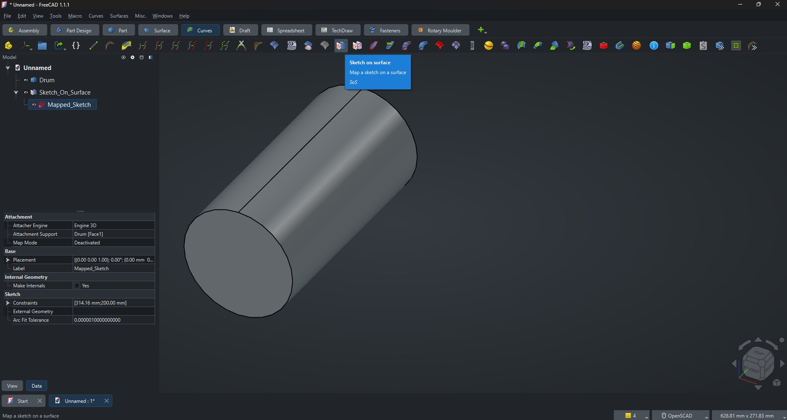

5. Double-click the `Mapped_Sketch` under the SoS object — this opens
   the Sketcher with a 314.16 × 200 mm boundary box representing the
   unwrapped drum surface. Draw your cookie outline (e.g. a 12 × 25 mm
   rectangle) inside this boundary.

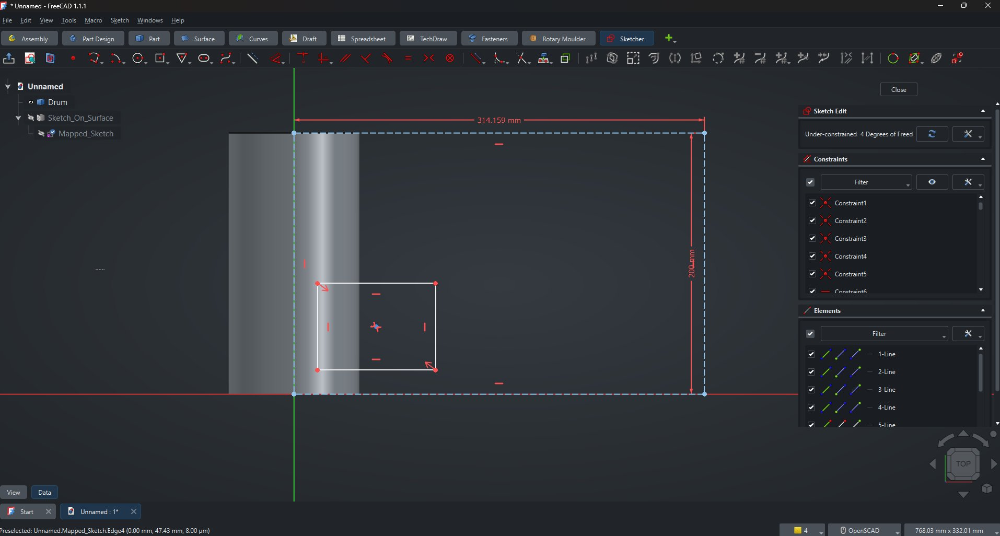

Switch back to the **Rotary Moulder** workbench.

### Step 4 — Add the cavity

1. Select the **drum** AND the **Sketch_On_Surface** (Ctrl+click in tree)
2. Click **Add Cavity From Sketch**
3. Three dialogs appear in sequence:
   - Cavity depth (default 3.1 mm)
   - Draft angle (default 16°)
   - Fillet radius (default 0.5 mm)

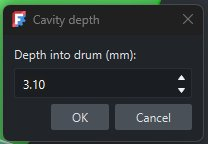
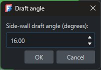
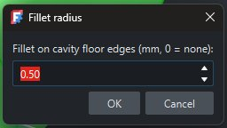

A `Cavity` object appears under the drum, and the drum now shows the
cavity carved into it. The SoS becomes a child of the cavity in the
tree.

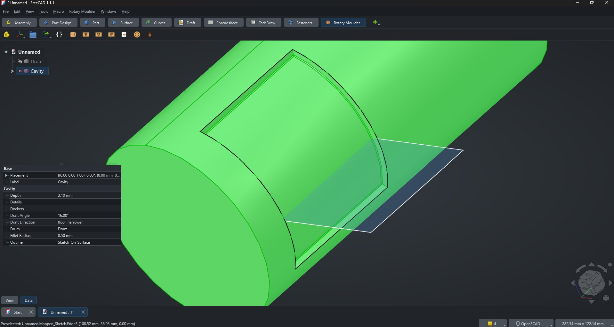

### Step 5 — Add a detail (text)

1. Make another **flat sketch** on the XY plane (no SoS this time —
   the workbench projects detail sketches internally)
2. Use **Sketcher → ShapeString** (under the Draft workbench's
   ShapeString tool) to add the text "MSC". The workbench has been
   tested with the font `verdanab.ttf` (Verdana Bold), which gives
   reliable letter shapes
3. Position the ShapeString inside the cookie outline area

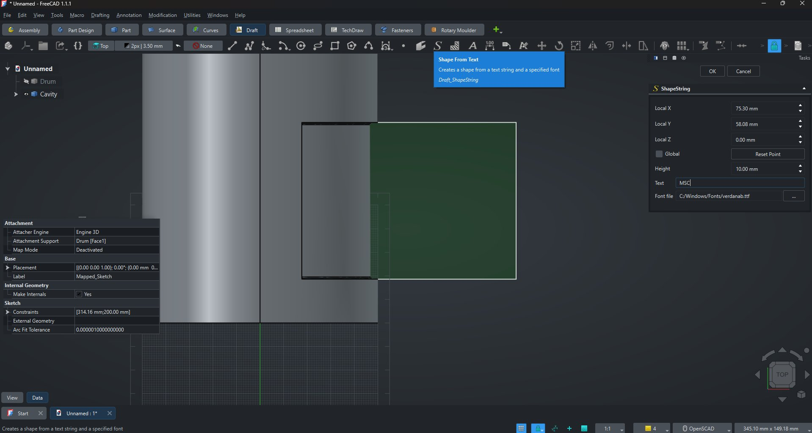

> **⚠ Important: mirror the text via InertialCS + Map Reversed**
>
> Because the cookie is formed by the drum's NEGATIVE volume (the
> cavity), text needs to be **mirrored** on the drum surface so that
> it reads correctly on the formed cookie. Otherwise, your text comes
> out reversed in the final product.
>
> To fix this, attach the ShapeString to the SoS's `Mapped_Sketch`
> with **Map Mode = `InertialCS`** and **Map Reversed = `Yes`**. This
> ensures the text is pre-mirrored to the drum, so the cookie reads
> correctly.

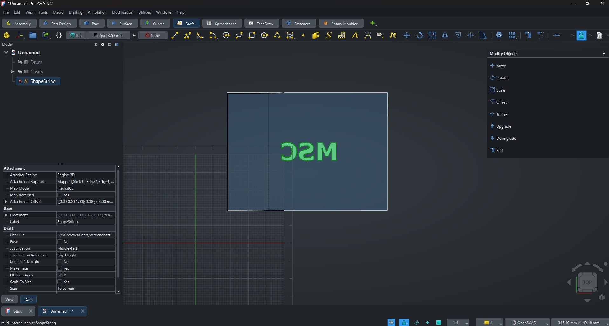

4. Close the sketch
5. Select the **cavity** AND the **ShapeString**
6. Click **Add Detail to Cavity**
7. Choose:
   - Mode: **emboss** (raised) or **engrave** (recessed)
   - Depth: 0.5 mm
   - Draft angle: 16°

The text appears on the cavity floor. With the mirror applied via
InertialCS+Map Reversed, it shows mirrored ON the drum — which means
correct ON the formed cookie.

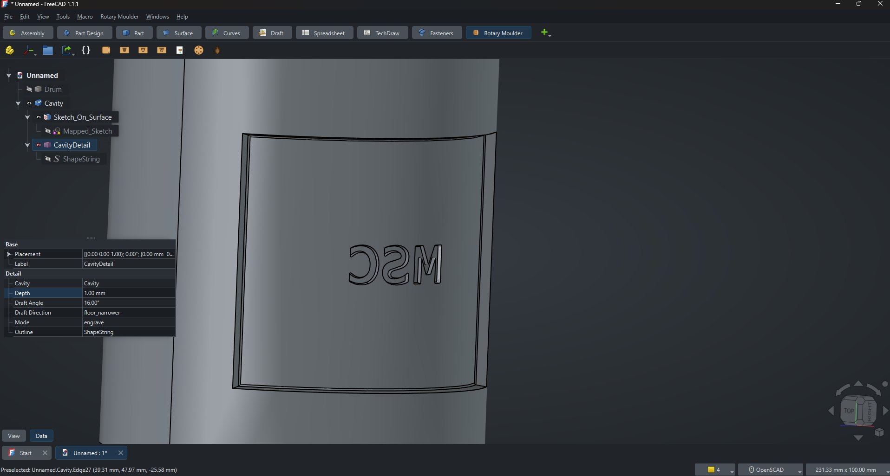

Switching to emboss mode (or using a second detail object with
emboss mode) produces raised text instead:

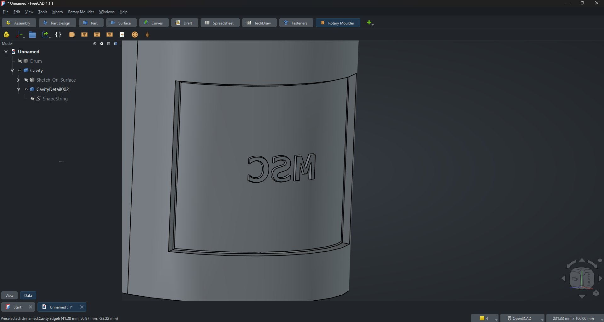

### Step 6 — Add docker pins

Docker pins are perforations that pierce through the entire cookie
thickness, like the dots on a cracker.

1. Make another **flat sketch** on the XY plane (also use
   `InertialCS` + `Map Reversed` to mirror the pin positions to match
   the cookie orientation)
2. Use **Sketcher → Create point** to place a few points within your
   cookie outline area
3. Close the sketch
4. Select the **cavity** AND the **points sketch**
5. Click **Add Docker Pins to Cavity**
6. Choose:
   - Tip diameter: 0.2 mm (default — small for cracker-style dots)
   - Draft angle: 16°

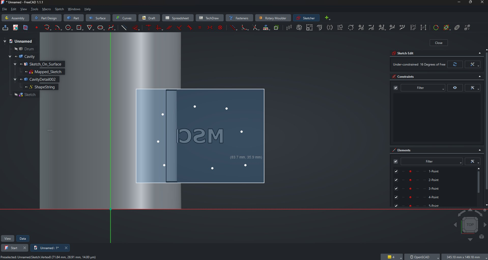

Each point becomes a small mushroom-shaped pin protruding from the
cavity floor toward the drum surface.

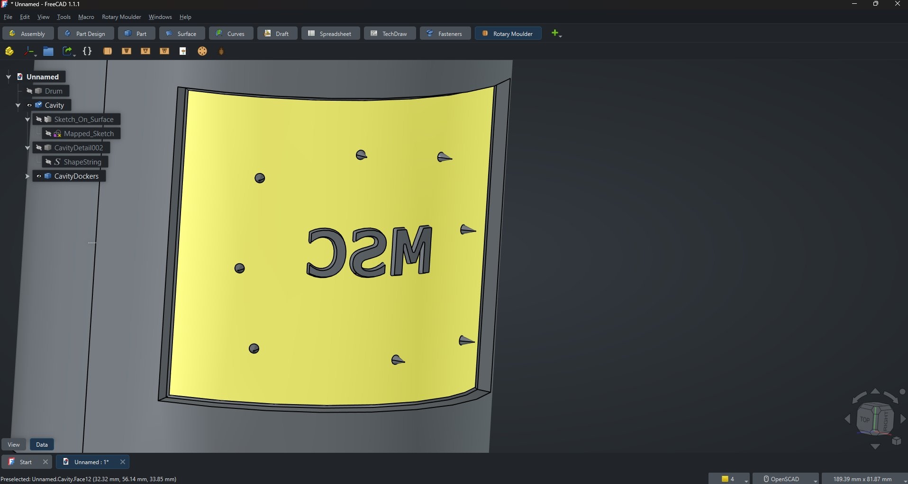

### Step 7 — Pattern around the drum

Now we replicate the cavity into a full pattern.

1. Select the **drum** AND the **cavity** (with all its details)
2. Click **Pattern Cavities Around Drum**
3. In the dialog, set:
   - Count around: 6
   - Count axial: 3
   - Spacing (mm): how far apart axially
   - Axial offset (mm): position of first row
   - Layout: **linear** (aligned grid) or **alternating** (brick pattern)
4. Click OK

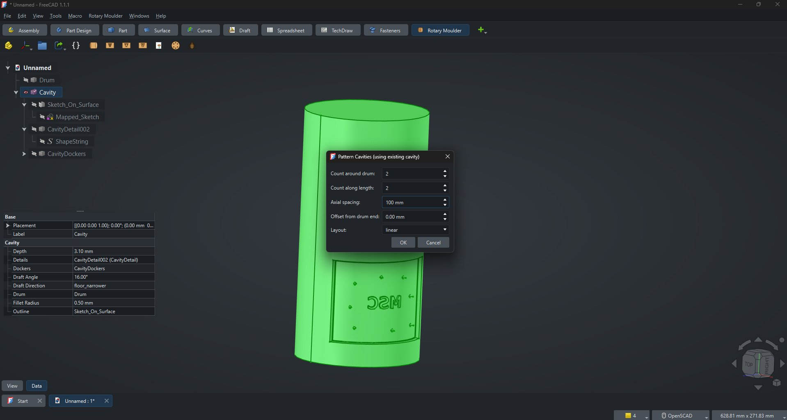

A `CavityPattern` object appears. The original cavity becomes its
source — every cavity instance inherits the source's details and
docker pins automatically.

**Linear layout:**

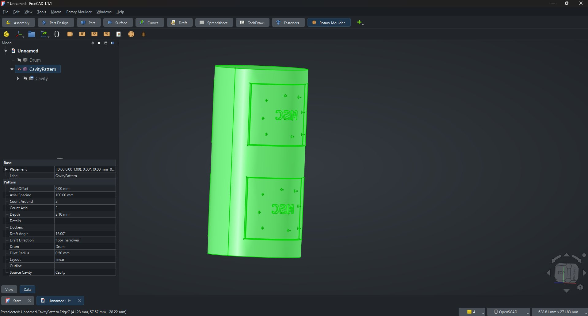

**Alternating layout** (each row angularly offset by half the step):

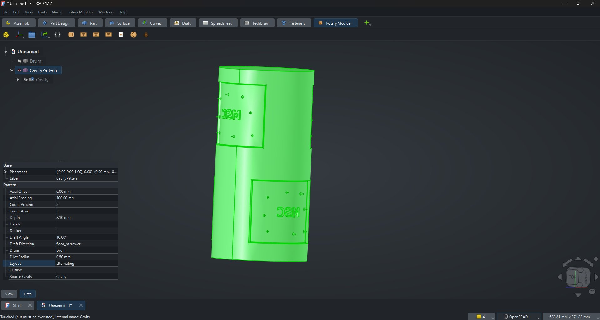

### Step 8 — Export

Once the drum looks right, use FreeCAD's standard export tools
(`File → Export As…`) to save it as STEP / STL / etc. for
manufacturing.

---

## 3. Command reference

### Create Drum

Creates a cylindrical drum at the origin, axis along Y.

| Property | Default | Notes                  |
|----------|---------|------------------------|
| Diameter | 100 mm  | Outer diameter of drum |
| Length   | 200 mm  | Drum length along Y    |

### Add Cavity From Sketch

Cuts a drafted cavity into the drum. Requires the drum + a
**Sketch_On_Surface** object (the cookie outline projected onto the
drum's cylindrical face via the Curves Workbench) selected.

| Field          | Default | Notes                                       |
|----------------|---------|---------------------------------------------|
| Depth          | 3.1 mm  | Cavity depth (cookie thickness)             |
| Draft angle    | 16°     | Side-wall draft for release                 |
| Fillet radius  | 0.5 mm  | Rounding between floor and walls (optional) |

> The workbench also accepts a plain flat sketch as fallback (via an
> older code path), but **Sketch_On_Surface is strongly recommended**
> for accurate projection onto the drum.

### Add Detail to Cavity

Adds engraved or embossed text/shapes to the cavity floor. Requires a
cavity (or pattern) + flat sketch on the XY plane selected. The
sketch is projected internally using the parent cavity's SoS mapping.

| Field        | Default     | Notes                                |
|--------------|-------------|--------------------------------------|
| Mode         | engrave     | `engrave` (recessed) or `emboss` (raised) |
| Depth        | 0.5 mm      | Detail depth/height                  |
| Draft angle  | 16°         | Detail draft for release             |

A single detail can contain multiple shapes — e.g. one sketch with the
text "MSC" produces three letter chunks treated together.

> **ShapeString font**: the workbench has been tested with
> `verdanab.ttf` (Verdana Bold). Other fonts may work but some have
> complex letter shapes that can produce volume-estimation warnings
> in the report view (geometry is still correct).

### Add Docker Pins to Cavity

Adds perforation pins to the cavity floor. Pin tips reach the drum
surface, so the formed cookie has pin-prick holes all the way through.

Requires a cavity + sketch containing **points** (use Sketcher's
Create Point tool) selected.

| Field             | Default | Notes                              |
|-------------------|---------|------------------------------------|
| Tip diameter      | 0.2 mm  | Diameter at top (dome-end)         |
| Draft angle       | 16°     | Side-wall draft of pin             |

Pin height equals the cavity depth automatically. Base diameter is
computed from the draft angle and depth.

### Pattern Cavities Around Drum

Replicates a cavity (with its details and dockers) around the drum.

Requires either:

- **Drum + Cavity** selected — uses the cavity's existing settings
  (depth, angle, etc.) and only asks for pattern parameters; or
- **Drum + Sketch** selected — also asks for cavity parameters and
  builds the pattern directly from the sketch without an intermediate
  Cavity object

| Field          | Default | Notes                                          |
|----------------|---------|------------------------------------------------|
| Count around   | 6       | Number of cavities around the drum perimeter   |
| Count axial    | 3       | Number of rows along the drum length           |
| Spacing        | 50 mm   | Distance between axial rows                    |
| Axial offset   | 25 mm   | Y position of the first row                    |
| Layout         | linear  | `linear` or `alternating` (brick-like)         |

### Import Cookie Outline (SVG/DXF)

Imports an SVG or DXF file as a flat sketch that can be used as a
cookie outline or detail.

### Toggle Debug Intermediates

Toggles whether the workbench saves intermediate construction shapes
to an `RM_Debug` group in the tree. Useful when geometry construction
fails — the intermediate wires, shells, caps, etc. are visible for
diagnosis.

State is persistent across FreeCAD sessions. The button label may not
refresh until you switch workbenches and back.

---

## 4. Object reference

### Drum

| Property | Type   | Default | Notes                  |
|----------|--------|---------|------------------------|
| Diameter | Length | 100 mm  | Outer drum diameter    |
| Length   | Length | 200 mm  | Drum length along Y    |

### DraftedCavity

| Property        | Type         | Default          | Notes                                  |
|-----------------|--------------|------------------|----------------------------------------|
| Drum            | Link         | (required)       | Parent drum                            |
| Outline         | Link         | (required)       | Sketch_On_Surface projecting a flat sketch |
| Depth           | Length       | 3.1 mm           | Cavity depth                           |
| DraftAngle      | Angle        | 16°              | Side-wall draft                        |
| DraftDirection  | Enumeration  | floor_narrower   | Only option                            |
| FilletRadius    | Length       | 0.5 mm           | Floor-wall fillet (0 disables)         |
| Details         | LinkList     | []               | CavityDetail children                  |
| Dockers         | LinkList     | []               | CavityDockers children                 |

### CavityDetail

| Property        | Type         | Default          | Notes                                   |
|-----------------|--------------|------------------|-----------------------------------------|
| Cavity          | Link         | (required)       | Parent cavity (or pattern)              |
| Outline         | Link         | (required)       | Flat sketch on XY plane                 |
| Depth           | Length       | 0.5 mm           | Detail depth (engraving) or height (emboss) |
| DraftAngle      | Angle        | 16°              | Draft for release                       |
| DraftDirection  | Enumeration  | floor_narrower   | Only option                             |
| Mode            | Enumeration  | engrave          | `engrave` or `emboss`                   |

### CavityDockers

| Property        | Type         | Default          | Notes                                       |
|-----------------|--------------|------------------|---------------------------------------------|
| Cavity          | Link         | (required)       | Parent cavity (or pattern)                  |
| Outline         | Link         | (required)       | Flat sketch on XY plane with point vertices |
| TipDiameter     | Length       | 0.2 mm           | Diameter at pin top                         |
| DraftAngle      | Angle        | 16°              | Pin side-wall draft                         |

### CavityPattern

| Property        | Type         | Default          | Notes                                       |
|-----------------|--------------|------------------|---------------------------------------------|
| Drum            | Link         | (required)       | Parent drum                                 |
| SourceCavity    | Link         | (optional)       | If set, inherits depth/angle/details/dockers from it |
| Outline         | Link         | (optional)       | Used when SourceCavity is None              |
| Depth           | Length       | 3.1 mm           | Cavity depth (used when SourceCavity is None) |
| DraftAngle      | Angle        | 16°              | (used when SourceCavity is None)            |
| FilletRadius    | Length       | 0.5 mm           | (used when SourceCavity is None)            |
| CountAround     | Integer      | 6                | Cavities around the drum perimeter          |
| CountAxial      | Integer      | 3                | Rows along the drum                         |
| Spacing         | Length       | 50 mm            | Axial spacing between rows                  |
| AxialOffset     | Length       | 25 mm            | First row Y position                        |
| Layout          | Enumeration  | linear           | `linear` or `alternating`                   |
| Details         | LinkList     | []               | Extra details added to the pattern itself   |
| Dockers         | LinkList     | []               | Extra docker groups added to the pattern    |

---

## 5. Patterns

### Two ways to define a pattern

**From a Cavity** (recommended): make one cavity, add details and
dockers to it, then pattern it. The pattern inherits everything from
the source cavity and you only need to set how many copies to make.

**From a Sketch**: skip the standalone cavity and define the pattern
directly. Useful for simple patterns without details.

### How the pattern is built

For performance, the workbench builds the cavity-with-details once at
the origin (the "master"), then copies and rotates that master to
each pattern position and does a single boolean cut. This is much
faster than building each cavity independently.

### Linear vs alternating layout

- **Linear**: cavities aligned in a perfect grid
- **Alternating**: every other row is angularly offset by half the
  step (brick-like). Good for packing more cookies on the drum.

### Adding details to the pattern itself

You can attach additional details or dockers directly to the
CavityPattern (in addition to those inherited from the SourceCavity).
These apply to every cavity instance.

---

## 6. Docker pins

### Anatomy of a pin

Each pin is a truncated cone with a hemispherical (dome) tip:

```
       (dome)
       /---\
      /     \    <- tip diameter (e.g. 0.2 mm)
      |     |
      |     |
     /       \   <- truncated cone with draft
    /         \
   /___________\  <- base diameter = tip + 2 × height × tan(draft)
  cavity floor
```

The pin's tip sits just below the drum's outer surface (0.05 mm
clearance for boolean reliability). In practice this means the
formed cookie has a pin-prick going almost all the way through.

### How positions are specified

The outline sketch should contain **points** (Sketcher → Create
Point) at each desired pin location. The sketch's coordinates map to
the same flat-XY space as the cavity outline: X around the drum, Y
along the drum.

Each vertex in the sketch becomes one pin. Both standalone Point
elements and the vertices of more complex sketch elements would be
detected.

### Default parameters

The default 0.2 mm tip is sized for cracker-style perforations. For
larger biscuit perforations try 0.5 – 1 mm. The base diameter scales
automatically with the depth and draft angle.

---

## 7. Debug mode

When geometry construction fails (or just to understand what's
happening), enable debug mode by clicking the **Toggle Debug
Intermediates** button. Intermediate shapes are saved into a
`RM_Debug` group:

| Shape name pattern        | What it is                                        |
|---------------------------|---------------------------------------------------|
| `RM_cav_rim_wire`         | Cookie outline projected onto drum surface        |
| `RM_cav_floor_wire`       | Cookie outline at cavity floor (scaled inward)    |
| `RM_cav_side_shell`       | Loft surface between rim and floor wires          |
| `RM_cav_top_cap`          | Top closing face (on drum surface)                |
| `RM_cav_bot_cap`          | Bottom closing face (on cavity floor)             |
| `RM_cav_solid`            | Final cavity-chunk solid                          |
| `RM_det_fN_outer_*`       | Detail face N — chunks/wires/caps/solid           |

Debug state persists across FreeCAD sessions. Toggle off for cleaner
operation in production work.

---

## 8. Troubleshooting

### Text in details comes out backward on the formed cookie

When the cookie is formed by the drum's negative space, anything on
the drum is "mirrored" relative to the cookie. To compensate:

1. When creating the ShapeString for the detail, attach it to the
   SoS object's `Mapped_Sketch`
2. Set **Map Mode** = `InertialCS`
3. Set **Map Reversed** = `Yes`

This pre-mirrors the text on the drum so that the formed cookie reads
the right way around. The text will look backward in the FreeCAD
viewport — that's correct! It will read normally on the produced
cookie.

The same principle applies to docker pin positions if they should
match a specific orientation: use `InertialCS` + `Map Reversed` so
the pin placement on the formed cookie matches your sketch.

### The cavity is huge / misshapen

Common causes:

- **Missing Sketch_On_Surface**: the cavity outline should be a
  Sketch_On_Surface object, not the flat sketch itself. The SoS
  object is what tells the workbench where on the drum the outline
  belongs. If you select the flat sketch directly, the workbench
  falls back to a less-accurate projection that may misposition the
  cavity.
- **Sketch placement**: the source flat sketch must be on the
  **XY plane** with the outline in positive coordinates within the
  drum's unwrapped region (X = 0 to circumference, Y = 0 to drum
  length).
- **Sketch coordinates out of bounds**: if X > drum circumference, the
  outline wraps around and overlaps itself.
- **Open wires**: the sketch must have a closed outline. Check for
  small gaps with Sketcher's validate-sketch tool.

### Letter chunk's volume is wildly off (logs show "expected" vs actual)

This happens for complex letters with the generalFuse cap method.
The workbench detects this and falls back to a different cap-building
method automatically. The shape should still be correct visually
even when the volume estimate is off.

If the resulting cavity is corrupted (e.g. extends beyond drum
surface), enable debug mode and inspect the `RM_det_fN_outer_solid`
shapes — they should each fit cleanly inside the cavity volume.

### Pattern produces broken cavities / missing letters

This was a known issue with `Part.Compound(...).cut(...)` and
successive `.fuse(...)` calls degrading topology for complex shapes.
The workbench now batches all chunks through `multiFuse` first, which
solved it. If you see this regression, please report.

### Docker pins fail with "empty result"

Pin tips by default sit 0.05 mm below the drum surface. If you've
made the cavity depth very shallow (close to the tip radius), pins
may not have enough room. Try increasing cavity depth or decreasing
tip diameter.

### "Null shape" error in pattern

Usually means a master construction step failed silently. Enable
debug mode and check the report view for the specific failing step.
Common causes: an outline with self-intersecting edges, a detail
sketch positioned outside the cavity outline, or a pattern that wraps
around the drum (e.g. count_around × angular_step ≥ 360° + small
overlap).

### Toggle Debug button label doesn't update

The menu/toolbar text shows the state at the time the workbench was
initialized. Switching to another workbench and back will refresh it.
The actual toggle state IS persistent and IS applied — the label is
cosmetic.

### "still touched after recompute" warning in report

Harmless — a FreeCAD internal warning that occurs when objects in the
parent chain are recomputed in a non-strict order. Does not affect
the resulting geometry.

### Pattern doesn't appear / shows empty

Make sure the source cavity itself recomputed without errors first.
Then check that `CountAround × CountAxial > 0` and the spacing values
are sensible relative to your drum length.

---

*Last updated: as of session 5 (May 2026). Built for FreeCAD 1.1.*

---

## Authors & contact

Created by **Mike Passchier** with **Claude.ai** (Anthropic).

Questions, bug reports, or feedback: **hello@mikesprototype.com**
